# 🍽️ TeraQR Bistro – QR Restoran Sipariş Sistemi

**TeraQR Bistro**, gerçek restoran operasyonlarını temel alan, **QR Menü + Admin Panel + Mutfak Ekranı (KDS)** içeren modern ve ölçeklenebilir bir **QR tabanlı restoran sipariş ve yönetim sistemidir**.

Proje; **katmanlı mimari**, temiz UI yaklaşımı ve gerçek hayattaki restoran iş akışlarını birebir modelleme amacıyla geliştirilmiştir.

---

## 🚀 Proje Özeti

TeraQR Bistro ile restoranlar:

- 📱 QR Menü üzerinden müşterilere hızlı sipariş deneyimi sunar
- 🧑‍💼 Admin Panel üzerinden ürün, kategori ve fiyat yönetimi yapar
- 🍳 Mutfak Ekranı (KDS) ile siparişleri anlık olarak takip eder
- 🪑 Masa durumlarını ve doluluk oranlarını izler
- 📅 Rezervasyonları yönetir
- 📊 Satış, sipariş ve ciro analizlerini dashboard üzerinden görüntüler

Sistem; **API odaklı**, **genişletilebilir** ve **gerçek zamanlı özelliklere hazır** bir altyapı ile tasarlanmıştır.

---

## 🧩 Sistem Modülleri

### 🧑‍🍳 Admin Panel
- Genel yönetim dashboard’u
- Ürün & kategori CRUD işlemleri
- Sipariş yaşam döngüsü yönetimi
- Masa durum takibi
- Rezervasyon listeleri ve filtreleme
- Satış & istatistik ekranları

### 🍳 Mutfak Ekranı (KDS)
- Anlık sipariş listesi
- Durum bazlı sipariş akışı:
  - Yeni
  - Onaylandı
  - Hazırlanıyor
  - Hazır
  - Servis Edildi
  - İptal
- Sipariş detay modalı (ürün, adet, fiyat)

### 📱 QR Menü (Müşteri Arayüzü)
- Mobil uyumlu QR Menü
- Ürün listeleme (görsel, fiyat, açıklama)
- Restoran tanıtım ve iletişim sayfaları
- Hızlı ve sade kullanıcı deneyimi

---


## 🖼️ Ekran Görüntüleri

## 🌐 QR Menü – Müşteri Arayüzü (UI)

> QR kod ile erişilen, modern ve mobil uyumlu müşteri deneyimi

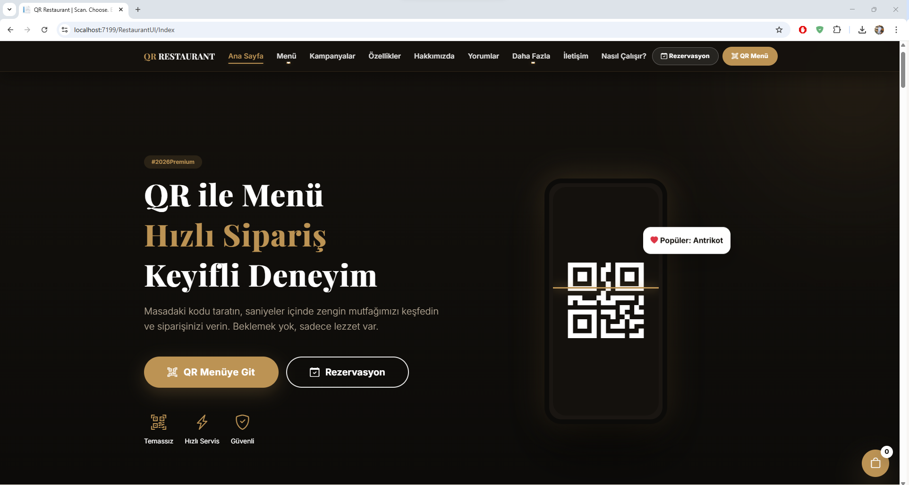
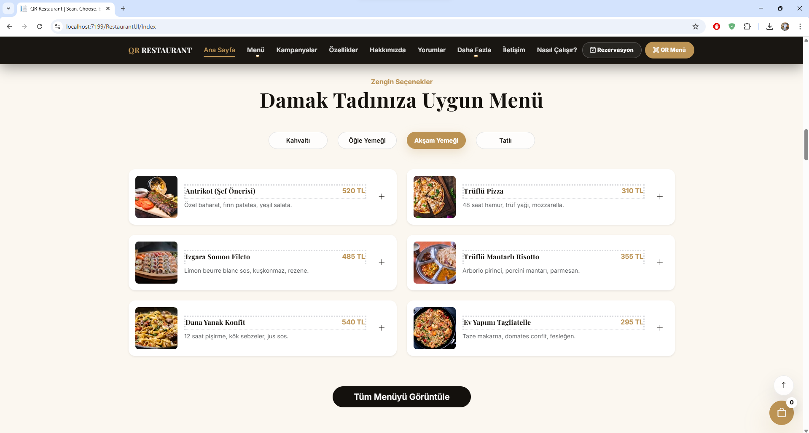
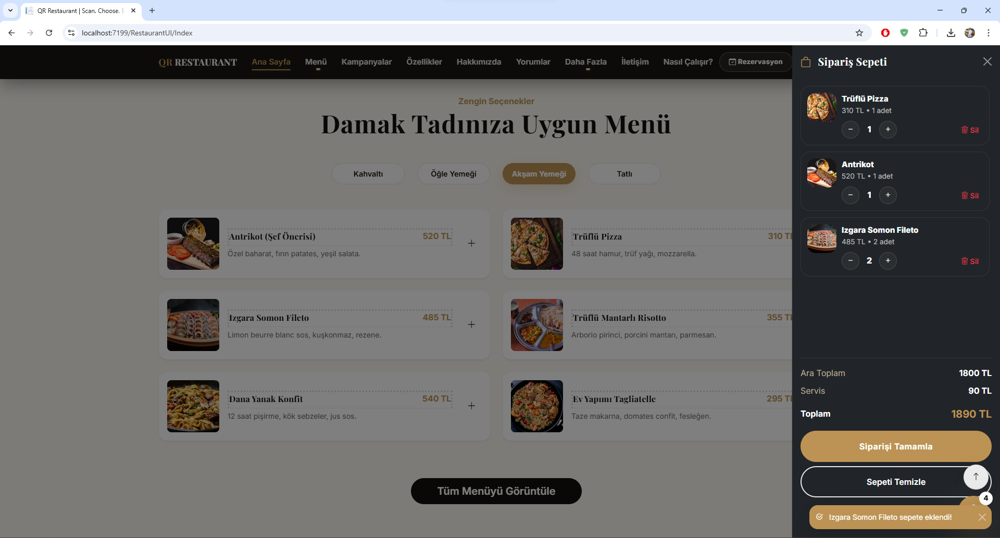
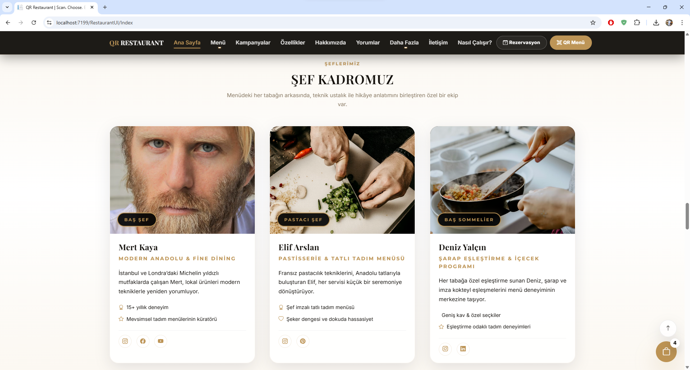
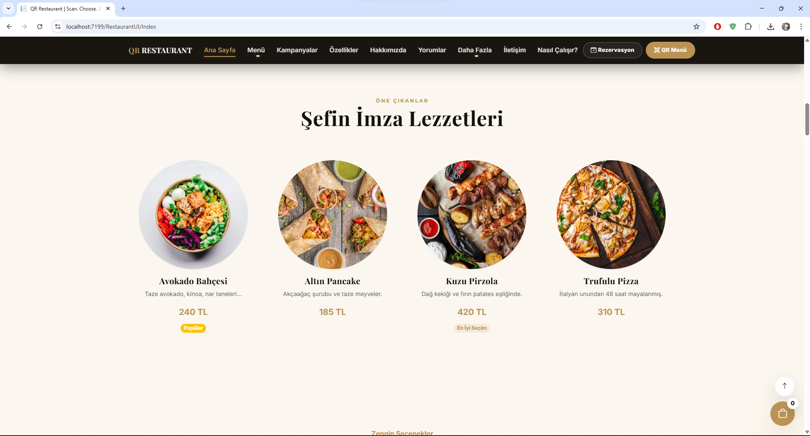
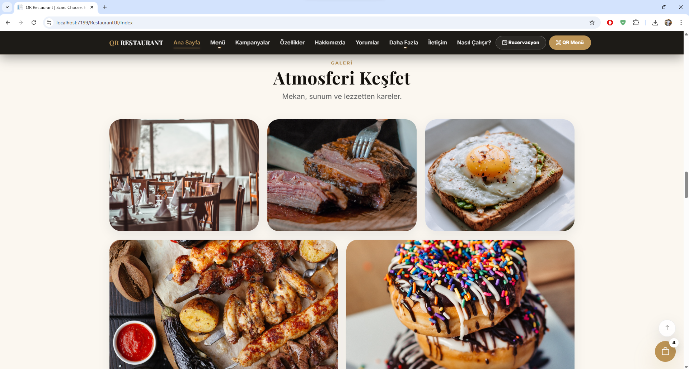
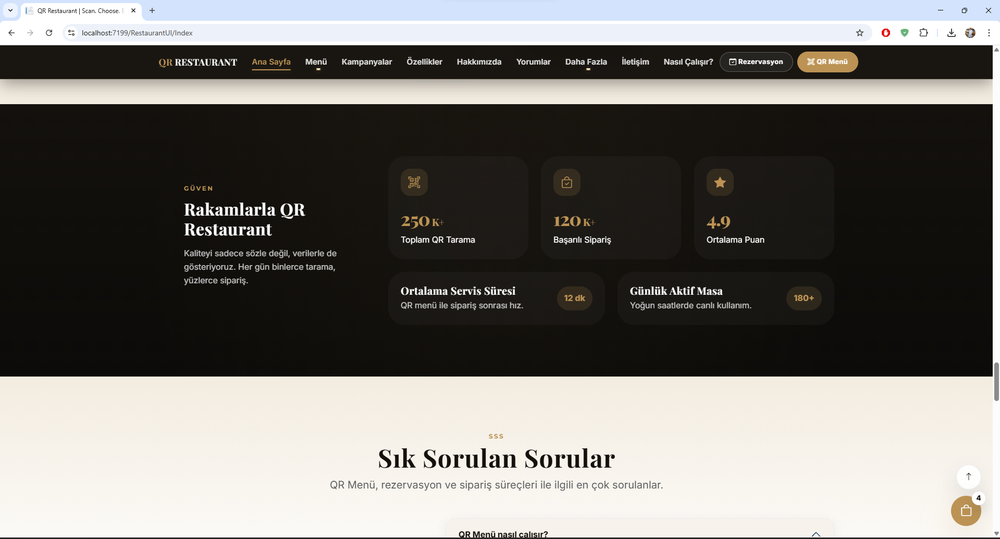
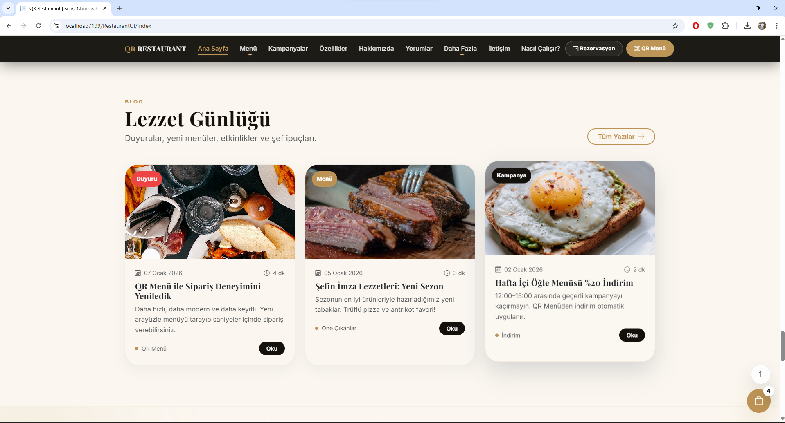
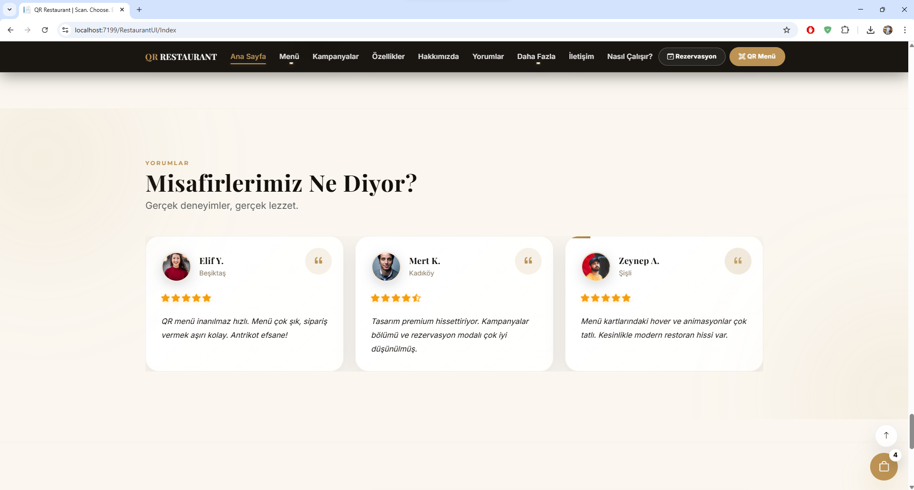
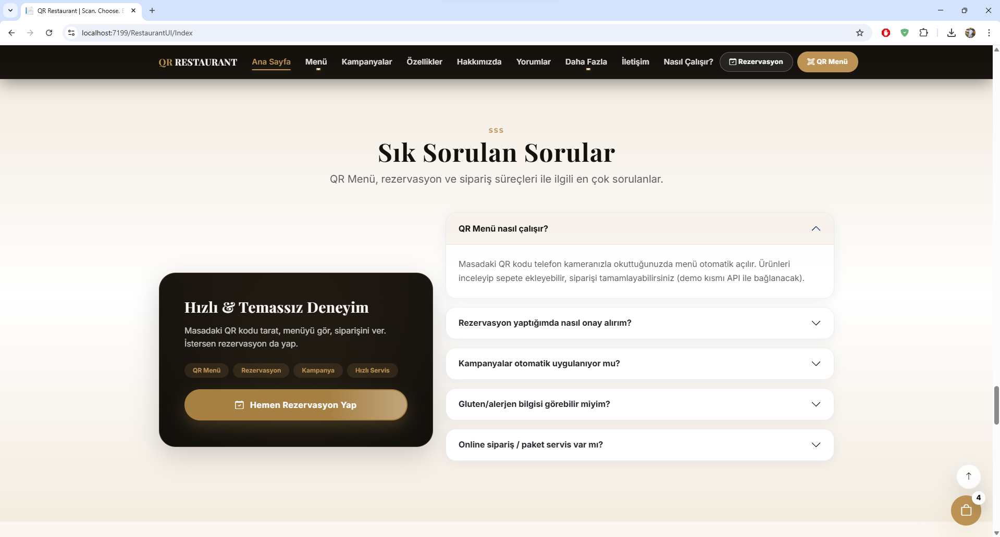
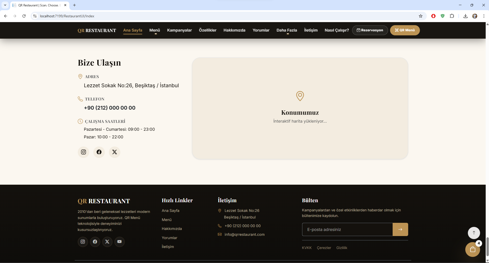

---

## 🛠️ Admin Panel

> Restoran yönetimi için geliştirilen kapsamlı ve gerçek zamanlı admin arayüzü

### 📊 Dashboard

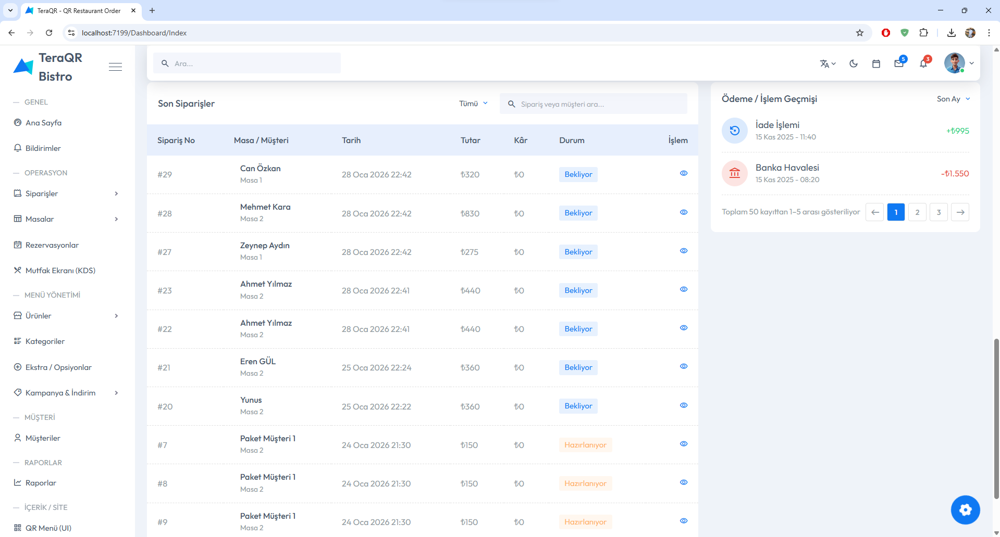

### 📦 Ürün Yönetimi
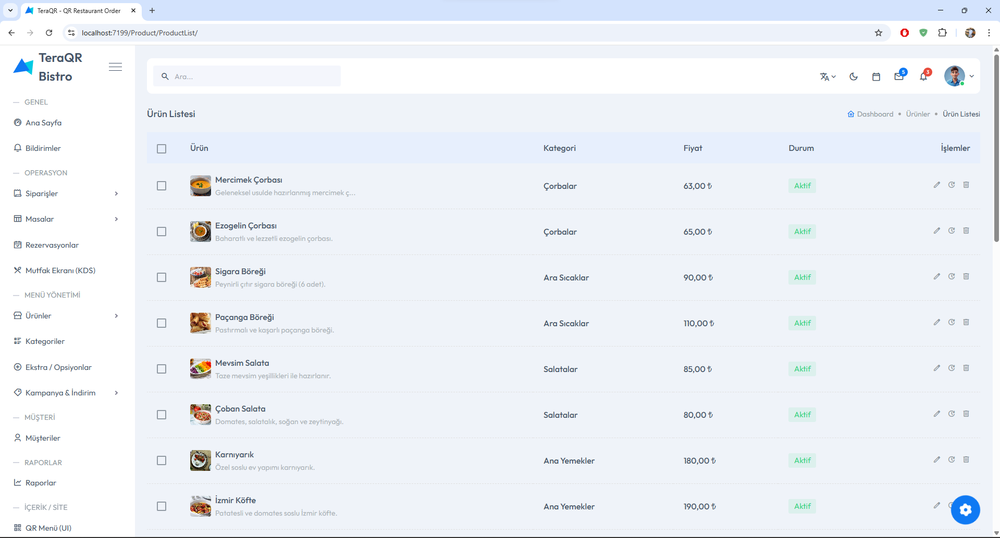


### 🍳 Mutfak Sipariş Ekranı (KDS)
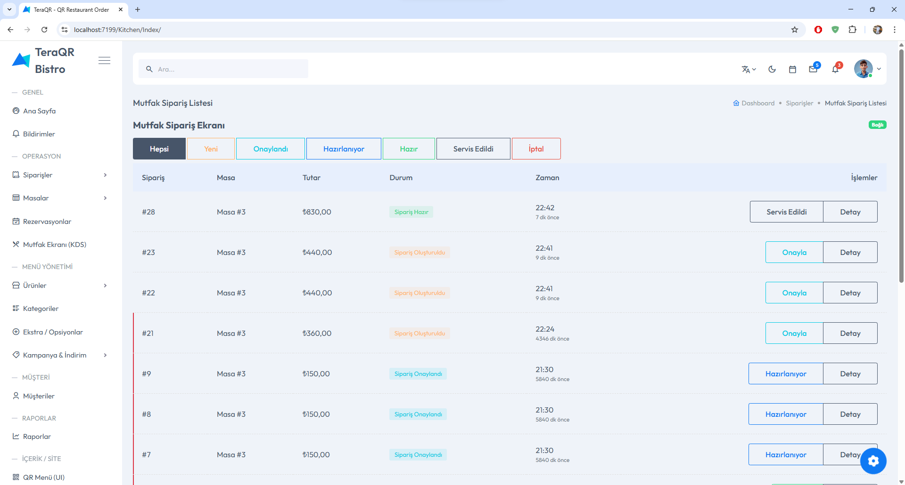
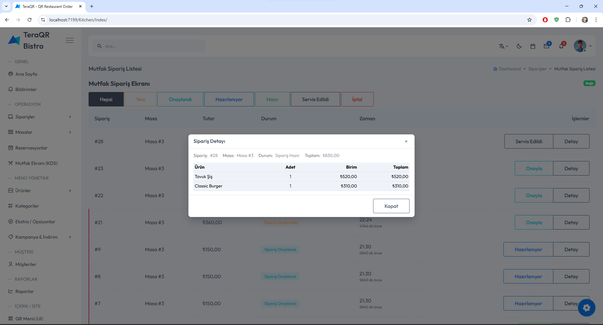

### 🪑 Masa Yönetimi
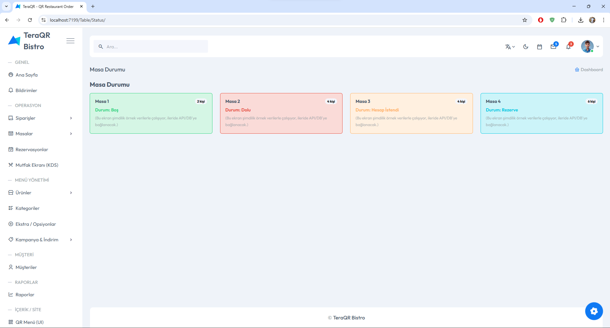

### 📅 Rezervasyon Yönetimi
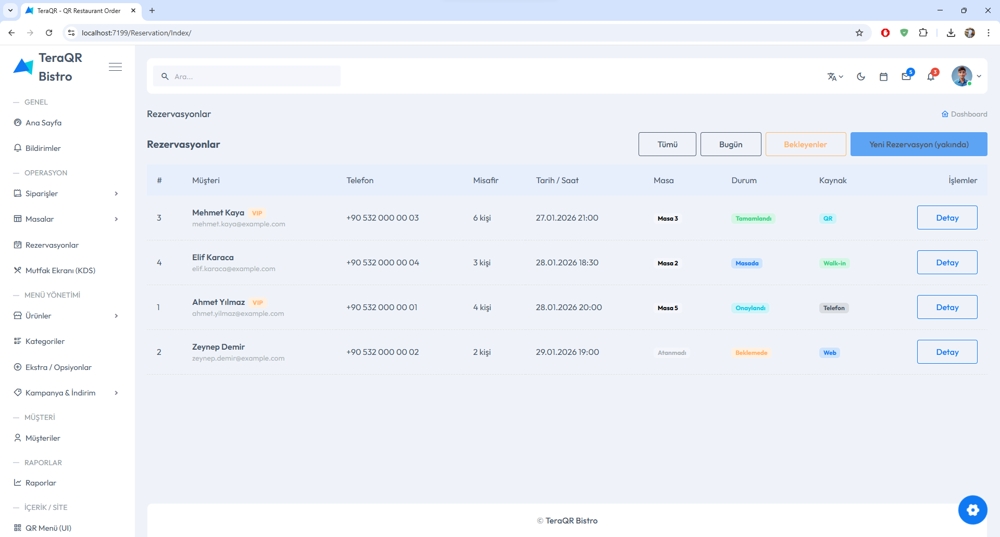


---

## 🏗️ Mimari Yapı

Proje **çok katmanlı mimari** ile geliştirilmiştir:

```md
Asp.NetCore10.0_QR_Restaurant_Order
├── EntityLayer        → Varlıklar (Entities)
├── DTOLayer           → Veri Transfer Nesneleri (DTO)
├── DataAccessLayer    → EF Core, DbContext, Repository
├── BusinessLayer      → İş kuralları & servisler
├── WebAPI             → RESTful API katmanı
└── WebUI              → Admin Panel & QR Menü


Bu yapı sayesinde:
- Katmanlar arası bağımlılık azaltılır
- Kod okunabilirliği ve sürdürülebilirlik artar
- UI ve API bağımsız geliştirilebilir

---

## ⚙️ Kullanılan Teknolojiler

- **ASP.NET Core 10**
- **Web API & MVC**
- **Entity Framework Core**
- **DTO tabanlı veri akışı**
- **Bootstrap & özel UI tasarımları**
- **SignalR entegrasyonuna hazır altyapı**
- **SQL Server**

---

## 🔄 Sipariş Durum Akışı

Sipariş ve ödeme durumları enum mantığıyla yönetilmektedir:

### Sipariş Durumları

0 → Sipariş Oluşturuldu
1 → Sipariş Onaylandı
2 → Hazırlanıyor
3 → Hazır
4 → Servis Edildi
5 → İptal Edildi

### Ödeme Durumu

true → Ödeme Alındı
false → Ödeme Alınmadı


---

## ⭐ Öne Çıkan Özellikler

- Gerçek restoran senaryolarına uygun iş akışı
- Modern ve temiz Admin Panel UI
- Mutfak odaklı sipariş yönetimi (KDS)
- QR tabanlı müşteri deneyimi
- Genişletilebilir ve ölçeklenebilir mimari

---

## 🛠️ Planlanan Geliştirmeler

- 🔴 SignalR ile gerçek zamanlı sipariş güncellemeleri
- 📱 QR Menü için gelişmiş kullanıcı etkileşimleri
- 📊 Detaylı raporlama ve analiz ekranları
- 🔐 Rol bazlı yetkilendirme
- 💳 Online ödeme entegrasyonu

---

## 👨‍💻 Geliştirici

**Yunus İNAN**  
.NET Developer  

GitHub: [https://github.com/Terabithia1572](https://github.com/Terabithia1572)

---

> ⚠️ Bu proje öğrenme, geliştirme ve portföy amacıyla hazırlanmıştır ancak gerçek restoran sistemleri mantığına uygun olarak tasarlanmıştır.


